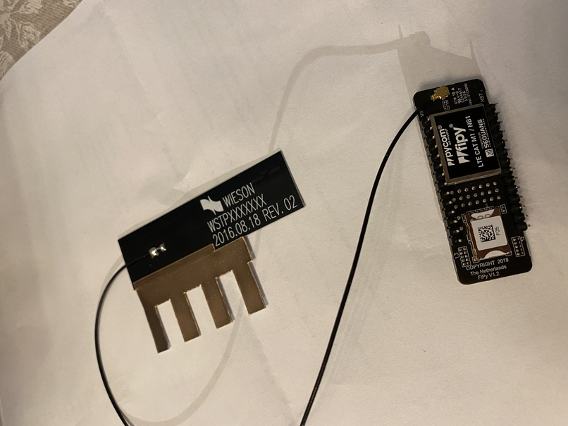

# iot

## Før du starter

### Plugg i antennen i din fypy
- Den flate antennen med fire gull-fargede "tenner" er LTE antennen, den skal plugges i antennekontakten på "undersiden" av modulen (samme side som sim-kort holderen)

### Sett i sim-kortet
- Sett i simkortet i sim-holderen på undersiden av modulen. gull-kontaktene på sim-kortet skal peke ned mot modulen, og siden med det lille hakket i kortet skal settes inn først.

### Plugg din fypy inn i enten expansion board, eller Pytrack2
- Hvis du bruker et expansion board, plugg modulen inn i de to innerste radene av pinneholdere.
- For både Expansion board og Pytrack så skal Fypy-en plugges i slik at den hvite firkanten (led-lampen) ligger over usbpluggen på kortet under.

## Oppsett for programmering av Fypy 

### Laste ned node.js:
Last ned "LTS"-versjonen her: https://nodejs.org/en/
Legg inn node.js (dette kan ta sin tid)

### Last ned VScode
- Last ned versjon 1.58 av VScode (OBS!! siste versjon vil ikke fungere) her: https://code.visualstudio.com/updates/v1_58 
  OBS: lenke til nedlastingen ligger under overskriften på siden Download: Windows: User (trykk på "user")
- Legg inn VScode.
- Åpne VScode 
- Trykk på File->Preferences->settings, søk etter update i søkefeltet øverst. Fjern haken ved "Enable Windows Background Updates" og velg "manuel" eller "none" under "Update: Mode"
- Lukk VScode, og start det på nytt.

### Legg inn pymakr
- i VScode, tykk på View->Extensions og skriv "pymakr" i søkefeltet øverst til venstre.
- Velg "Pymakr" fra listen og trykk på "install"-knappen.
- Etter at pymakr er installert så kan du lukke VScode, og starte det på nytt.

### koble til Fypy
- hvis alt er riktig nå så skal du ha en del nye ting nederst på den fargede linjen i VScode. (X Pymakr Console > Run ^ Upload v Download)
- hvis du nå plugger inn din Fypy (selve modulen må stå i enten et "expansion board" eller en "Pytrack") så skal symbolet til venstre for "Pymakr Console" bytte fra en X til en V.
- det skal også dukke opp tre >-tegn (>>>) i terminal-vinduet på bunnen.
- hvis du trykker til høyre for de tre >-tegnene og skriver pycom.heartbeat(False) og trykker enter så skal lyset på toppen av Fypy-en slutte å blinke blått.
- Gratulerer, du har nå fått satt opp miljøet slik at du kan programmere modulen din.

